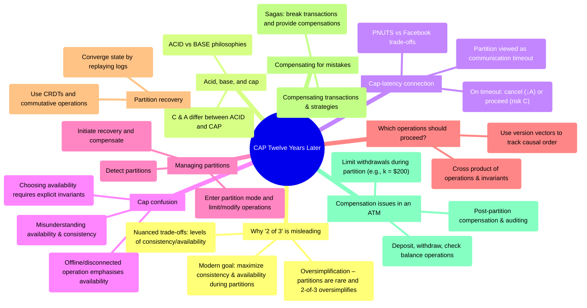

```mermaid 
mindmap
  Root((CAP Twelve Years Later))
    WhyMisleading["Why '2 of 3' is misleading"]
      Oversimplification("Oversimplification – partitions are rare and 2‑of‑3 oversimplifies")
      Nuance("Nuanced trade‑offs: levels of consistency/availability")
      ModernGoal("Modern goal: maximize consistency & availability during partitions")
    AcidBaseCap["Acid, base, and cap"]
      ACIDvsBASE("ACID vs BASE philosophies")
      Letters("C & A differ between ACID and CAP")
    Latency["Cap‑latency connection"]
      Timeout("Partition viewed as communication timeout")
      Decision("On timeout: cancel (↓A) or proceed (risk C)")
      Examples("PNUTS vs Facebook trade‑offs")
    Confusion["Cap confusion"]
      Availability("Misunderstanding availability & consistency")
      OfflineMode("Offline/disconnected operation emphasises availability")
      Invariants("Choosing availability requires explicit invariants")
    Managing["Managing partitions"]
      Detect("Detect partitions")
      PartitionMode("Enter partition mode and limit/modify operations")
      Recovery("Initiate recovery and compensate")
    Operations["Which operations should proceed?"]
      CrossProduct("Cross product of operations & invariants")
      VersionVectors("Use version vectors to track causal order")
    RecoverySection["Partition recovery"]
      Convergence("Converge state by replaying logs")
      CRDTs("Use CRDTs and commutative operations")
    Mistakes["Compensating for mistakes"]
      Compensation("Compensating transactions & strategies")
      Sagas("Sagas: break transactions and provide compensations")
    ATM["Compensation issues in an ATM"]
      OperationsATM("Deposit, withdraw, check balance operations")
      Limit("Limit withdrawals during partition (e.g., k = $200)")
      CompensationATM("Post‑partition compensation & auditing")
```