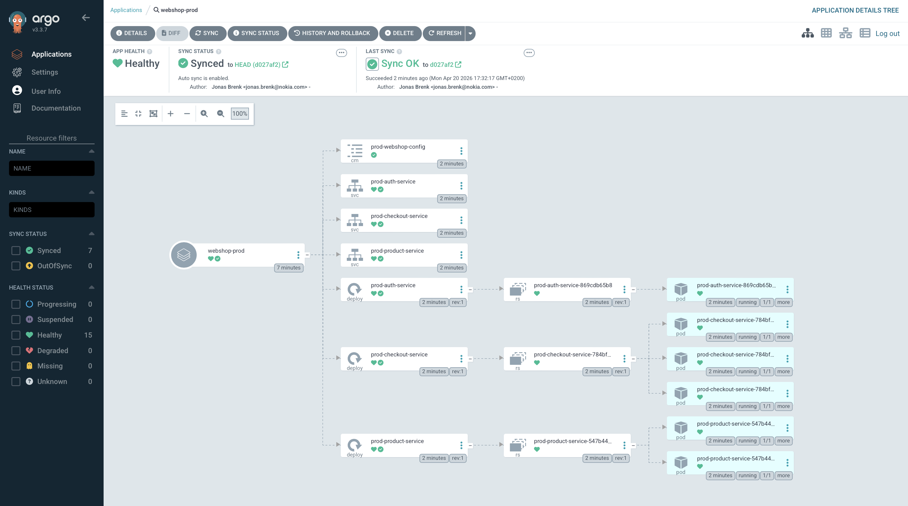
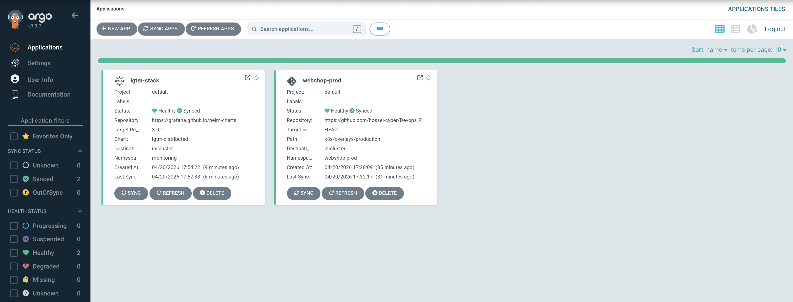
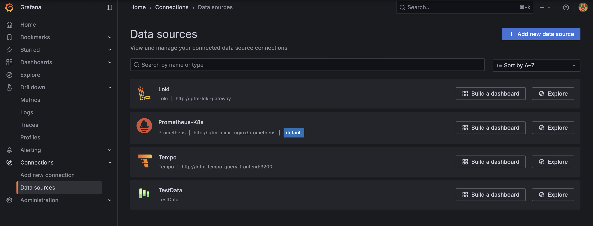
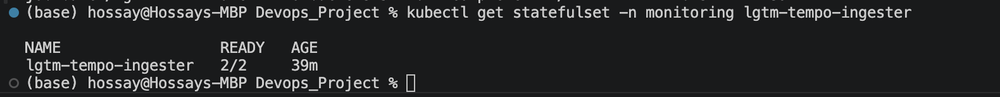
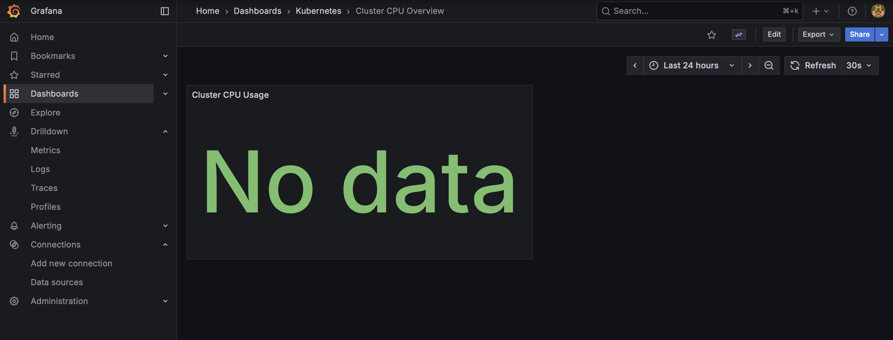
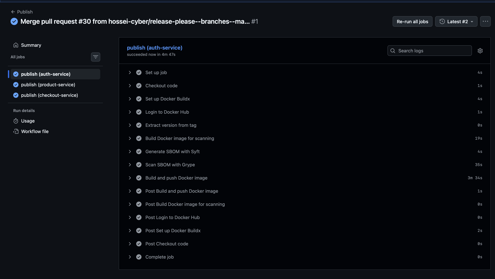
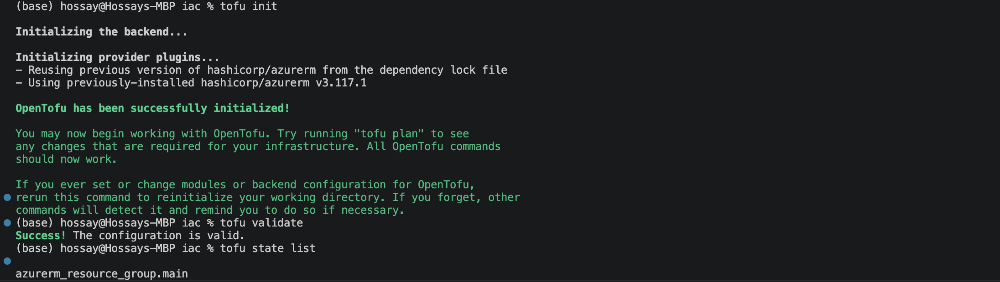
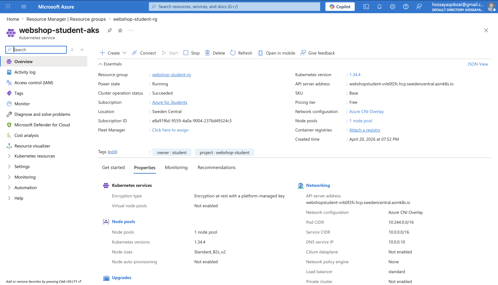
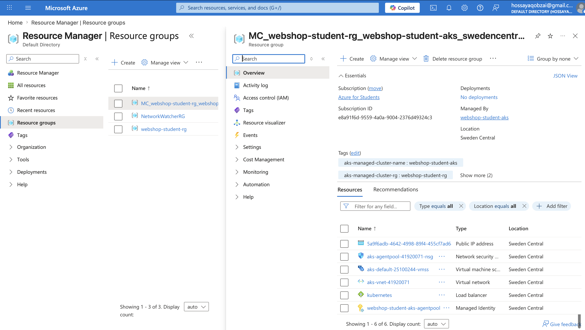

# Webshop

A simple REST API webshop built in Go for the DevOps lecture. It demonstrates a modular Go architecture, JWT authentication, a microservice-based structure, and basic API operations.

## Features

- Product catalog with self-care items
- JWT-based authentication
- RESTful API endpoints
- Modular Go project structure
- Split into three microservices:
  - `auth-service`
  - `product-service`
  - `checkout-service`

## Architecture

The application is structured as three Go microservices:

- `auth-service` — handles authentication endpoints
- `product-service` — provides product catalog endpoints
- `checkout-service` — handles order placement

Shared code is organized in reusable packages, including:

- `internal/...` for service-specific handlers
- `pkg/...` for shared helpers, authentication, and models

## API Endpoints

### Authentication

- `POST /auth/login` — User login (username: `user`, password: `pass`)
- `POST /auth/logout` — User logout

### Products

- `GET /products` — List all products
- `GET /products/{id}` — Get product details

### Orders

- `POST /checkout/placeorder` — Place order (requires authentication)

## Getting Started

### Prerequisites

- Go 1.23 or higher
- Git
- Docker (optional, for containerized execution)

### Installation

1. Clone the repository

   ```bash
   git clone https://github.com/hossei-cyber/Devops_Project.git
   cd Devops_Project
   ```

2. Install dependencies

   ```bash
   go mod download
   ```

## Run locally

### Start individual services

#### Auth service

```bash
go run ./auth-service/cmd/main.go
```

#### Product service

```bash
go run ./product-service/cmd/main.go
```

#### Checkout service

```bash
go run ./checkout-service/cmd/main.go
```

### Default service ports

- Individual local runs default to `localhost:8080`
- In Kubernetes, the services use ports `8081`, `8082`, and `8083`

### Test the API

```bash
curl http://localhost:8080/products
```

## Build Commands

### Build all services

```bash
make build-all
```

### Build a specific service

```bash
make build service=auth-service
make build service=product-service
make build service=checkout-service
```

### Additional Go commands

```bash
go fmt ./...
go mod tidy
go test ./...
```

## Authentication Demo

1. Login to get a token

   ```bash
   curl -X POST -d "username=user&password=pass" http://localhost:8080/auth/login
   ```

2. Use the token for orders

   ```bash
   curl -X POST -H "Authorization: Bearer YOUR_TOKEN_HERE" http://localhost:8080/checkout/placeorder
   ```

## Version Control Standards

### Branching Strategy

- Use feature branches for new features and bug fixes.
- Naming conventions:
  - Features: `feature/feature-name`
  - Bug fixes: `fix/bug-description`
  - Refactor: `refactor/description`
  - Documentation: use the `documentation` branch for docs-only changes
- Merge into `main` after code review.

### Commit Messages

- Use clear, descriptive messages.
- Feature commits: `feat: add new feature`
- Bug fixes: `fix: resolve bug description`
- Documentation: `docs: update documentation for feature`
- Refactoring: `refactor: improve code structure`

## Dockerization

Run the services in Docker containers.

### Build Docker images

```bash
docker build --build-arg SERVICE=auth-service -t hosseicyber/webshop-auth:latest .
docker build --build-arg SERVICE=product-service -t hosseicyber/webshop-product:latest .
docker build --build-arg SERVICE=checkout-service -t hosseicyber/webshop-checkout:latest .
```

### Run Docker containers

```bash
docker run -p 8081:8080 hosseicyber/webshop-auth:latest
docker run -p 8082:8080 hosseicyber/webshop-product:latest
docker run -p 8083:8080 hosseicyber/webshop-checkout:latest
```

### Docker Hub

1. Login to Docker Hub

   ```bash
   docker login
   ```

2. Tag the images

   ```bash
   docker tag hosseicyber/webshop-auth:latest hosseicyber/webshop-auth:<version>
   docker tag hosseicyber/webshop-product:latest hosseicyber/webshop-product:<version>
   docker tag hosseicyber/webshop-checkout:latest hosseicyber/webshop-checkout:<version>
   ```

3. Push the images

   ```bash
   docker push hosseicyber/webshop-auth:<version>
   docker push hosseicyber/webshop-product:<version>
   docker push hosseicyber/webshop-checkout:<version>
   ```

4. Pull the images

   ```bash
   docker pull hosseicyber/webshop-auth:<version>
   docker pull hosseicyber/webshop-product:<version>
   docker pull hosseicyber/webshop-checkout:<version>
   ```

Note: replace `<version>` with the actual version tag.

## Kubernetes Deployment

The application is containerized and ready for Kubernetes deployment with separate environments.

### Prerequisites

- Kubernetes cluster (minikube for local development)
- kubectl configured
- Docker images built and pushed

### Quick Start with Minikube

1. Start minikube cluster

   ```bash
   minikube start
   ```

2. Deploy to production environment

   ```bash
   kubectl apply -k k8s/overlays/production
   ```

3. Check deployment status

   ```bash
   kubectl get all -n webshop-prod
   ```

4. Access services via port forwarding

   ```bash
   kubectl port-forward -n webshop-prod svc/prod-auth-service 8081:8081
   kubectl port-forward -n webshop-prod svc/prod-product-service 8082:8082
   kubectl port-forward -n webshop-prod svc/prod-checkout-service 8083:8083
   ```

### Environment Configuration

#### Production Environment
- **Namespace**: `webshop-prod`
- **Replicas**: auth `1`, product `2`, checkout `3`
- **Resources**: Higher (128Mi RAM, 500m CPU)
- **Access**: ClusterIP services inside the cluster

### Service Endpoints in Kubernetes

- **Auth Service**: `prod-auth-service:8081`
- **Product Service**: `prod-product-service:8082`
- **Checkout Service**: `prod-checkout-service:8083`

### Deployment Commands

```bash
# Deploy production environment
kubectl apply -k k8s/overlays/production

# Delete production environment
kubectl delete -k k8s/overlays/production
```

### Testing Kubernetes Services

```bash
# Port forward for direct access
kubectl port-forward -n webshop-prod svc/prod-product-service 8082:8082

# Test the API
curl http://localhost:8082/products
```

## ArgoCD GitOps Deployment

For this task, Argo CD was installed in the local `minikube` cluster and used to deploy the webshop from this repository.

### Commands Used

```bash
minikube start --driver=docker

kubectl create namespace argocd
kubectl apply -n argocd -f https://raw.githubusercontent.com/argoproj/argo-cd/stable/manifests/install.yaml

docker build --build-arg SERVICE=auth-service -t hosseicyber/webshop-auth:latest .
docker build --build-arg SERVICE=product-service -t hosseicyber/webshop-product:latest .
docker build --build-arg SERVICE=checkout-service -t hosseicyber/webshop-checkout:latest .

minikube image load hosseicyber/webshop-auth:latest
minikube image load hosseicyber/webshop-product:latest
minikube image load hosseicyber/webshop-checkout:latest

kubectl apply -f argocd/webshop-application.yaml
kubectl get applications -n argocd
kubectl get all -n webshop-prod
```

### Result

- Argo CD was running successfully in the local cluster
- The application `webshop-prod` was created
- The application reached `Synced` and `Healthy`
- The webshop was deployed in namespace `webshop-prod`
- Running deployments:
  - `prod-auth-service` with `1` replica
  - `prod-product-service` with `2` replicas
  - `prod-checkout-service` with `3` replicas

### Argo CD UI

The UI was opened with:

```bash
kubectl port-forward svc/argocd-server -n argocd 8080:443
```



## Observability Deployment

For this task, an Argo CD `Application` was created to deploy the LGTM stack in the local `minikube` cluster via Helm.

### Commands Used

```bash
kubectl apply -f argocd/lgtm-stack-application.yaml
kubectl get applications -n argocd
kubectl get all -n monitoring
kubectl get statefulset -n monitoring lgtm-tempo-ingester
```

### Result

- The application `lgtm-stack` was created
- The LGTM stack was deployed in namespace `monitoring`
- The application reached `Synced` and `Healthy`
- The additional datasource `TestData` is available in Grafana
- `lgtm-tempo-ingester` was running with `2/2` replicas
- The dashboard `Cluster CPU Overview` was provisioned in Grafana

### Screenshots

Argo CD application overview:



Grafana data sources:



Tempo replica count:



Provisioned dashboard:



## DevSecOps Pipeline

For this task, the existing GitHub Actions publish workflow was extended with container image scanning.

### Commands Used

The workflow in `.github/workflows/publish.yml` was updated to:

- build the Docker image
- generate an SBOM with Syft
- scan the SBOM with Grype
- push the Docker image afterwards

### Result

- The publish workflow includes a container image scanning step
- An SBOM is generated with Syft
- The SBOM is scanned with Grype for CVEs
- The scan is executed after the Docker build step
- The GitHub Actions workflow ran successfully

### Screenshot



## Infrastructure as Code

For this task, OpenTofu was used to provision Azure infrastructure for the webshop.

### Commands Used

```bash
az login

cd iac
tofu init
tofu validate
tofu plan
tofu apply
tofu destroy
```

### Result

- OpenTofu configuration was created for Azure
- A resource group and an AKS cluster were provisioned
- The Azure region was configured through variables
- The created infrastructure was visible in the Azure Portal

### Screenshots

OpenTofu initialization and validation:



AKS cluster overview in Azure:



AKS-managed resource group in Azure:


