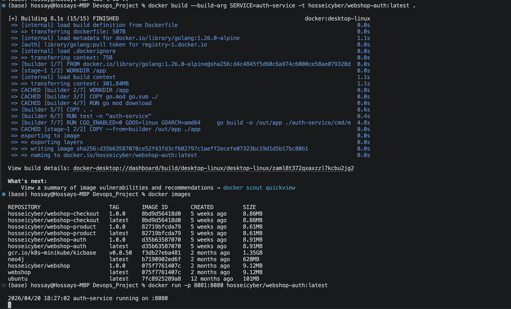
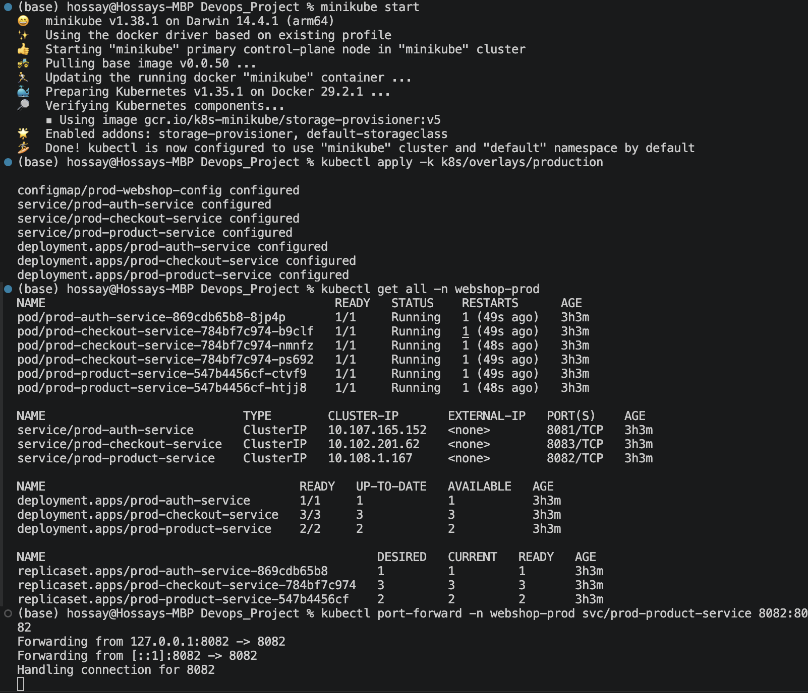
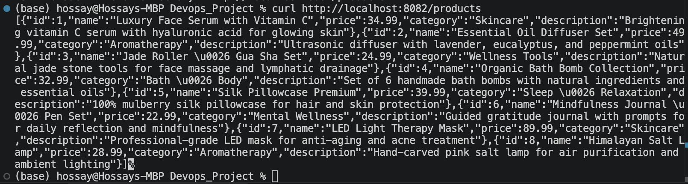
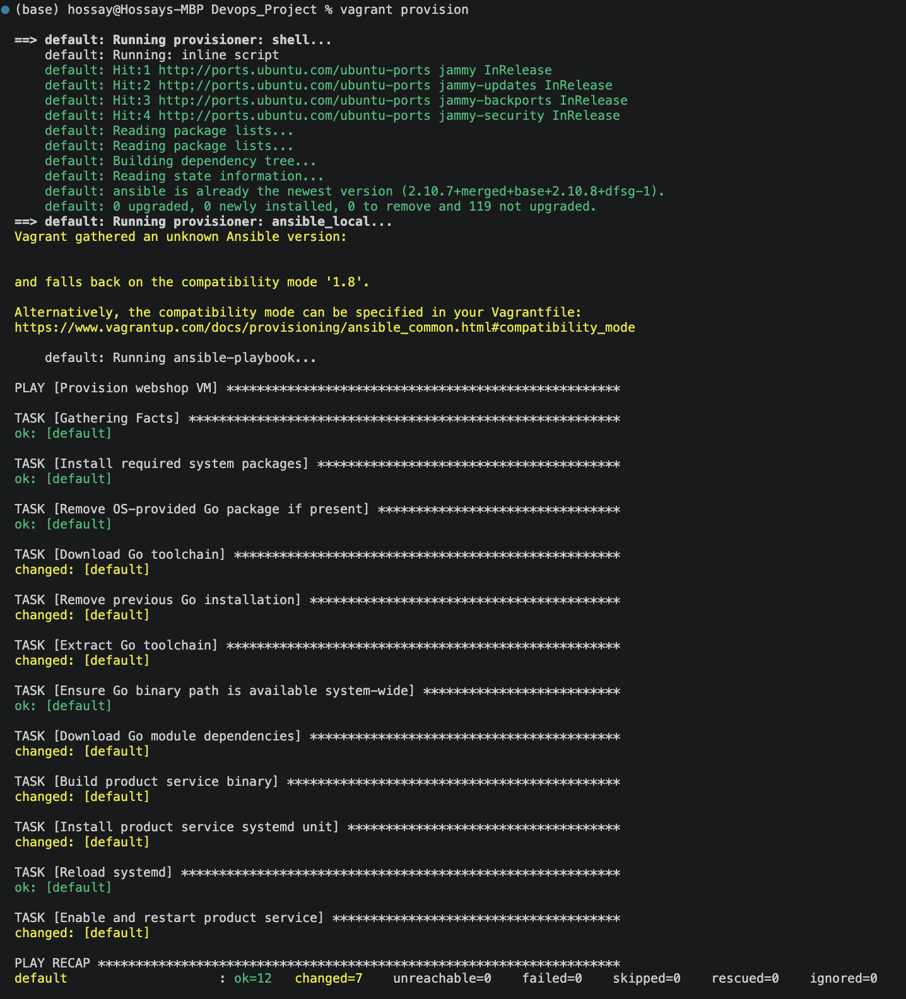
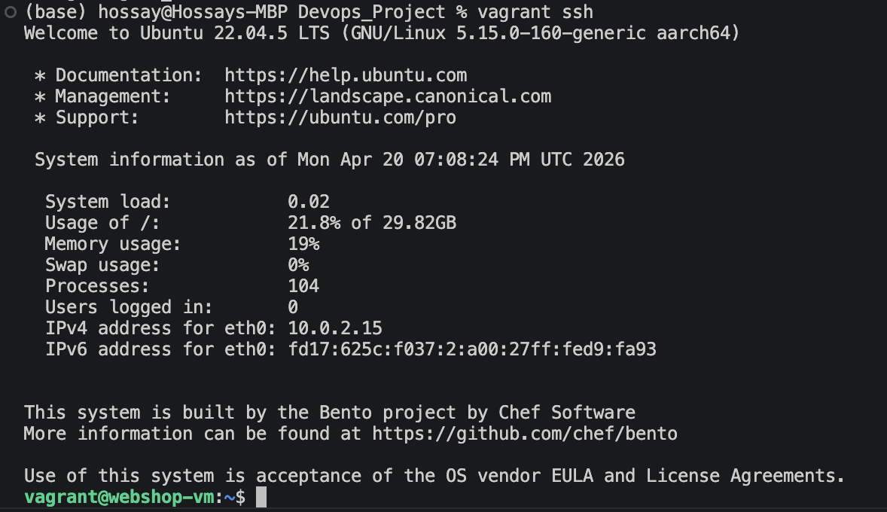
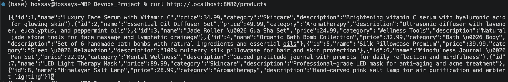

# Webshop

A simple Go webshop project for the DevOps lecture. The application is split into three backend services and was used across the course tasks for Docker, Kubernetes, GitOps, observability, DevSecOps, IaC, and VM deployment.

## Table of Contents

- [App](#app)
- [Version Control Standards](#version-control-standards)
- [CI/CD Pipeline](#cicd-pipeline)
- [Dockerization](#dockerization)
- [Kubernetes Deployment](#kubernetes-deployment)
- [VM Deployment](#vm-deployment)
- [ArgoCD GitOps Deployment](#argocd-gitops-deployment)
- [Observability Deployment](#observability-deployment)
- [DevSecOps Pipeline](#devsecops-pipeline)
- [Infrastructure as Code](#infrastructure-as-code)

---

## App

### Services

- `auth-service` handles login and logout
- `product-service` provides the product catalog
- `checkout-service` handles order placement

### API Endpoints

- `POST /auth/login` — User login (username: `user`, password: `pass`)
- `POST /auth/logout` — User logout
- `GET /products` — List all products
- `GET /products/{id}` — Get product details
- `POST /checkout/placeorder` — Place order (requires authentication)

### Local Run

#### Prerequisites
- Go 1.23 or higher
- Git
- Docker (optional, for containerized execution)

#### Setup

```bash
git clone https://github.com/hossei-cyber/Devops_Project.git
cd Devops_Project
go mod download
```

#### Start a service

```bash
go run ./product-service/cmd/main.go
```

#### Test

```bash
curl http://localhost:8080/products
```

---

## Version Control Standards

### Branching Strategy

- Use feature branches for new features and bug fixes.
- Naming conventions:
  - Features: `feature/feature-name`
  - Bug fixes: `fix/bug-description`
  - Refactor: `refactor/description`
  - Documentation: use the `documentation` branch for docs-only changes
- Merge into `main` after code review.

### Commit Messages

- Use clear, descriptive messages.
- Feature commits: `feat: add new feature`
- Bug fixes: `fix: resolve bug description`
- Documentation: `docs: update documentation for feature`
- Refactoring: `refactor: improve code structure`

---

## CI/CD Pipeline

For this task, GitHub Actions workflows were configured for continuous integration and continuous delivery.

### Files Used

- `.github/workflows/go.yml`
- `.github/workflows/publish.yml`
- `.github/workflows/release-please.yml`

### Result

- The CI workflow builds and tests the Go project on pushes and pull requests to `main`
- The publish workflow builds and publishes Docker images for all webshop services on version tags
- The release workflow automates versioning and release preparation on `main`

---

## Dockerization

For this task, the webshop services were containerized with Docker and published to Docker Hub.

### Commands Used

```bash
docker build --build-arg SERVICE=auth-service -t hosseicyber/webshop-auth:latest .
docker build --build-arg SERVICE=product-service -t hosseicyber/webshop-product:latest .
docker build --build-arg SERVICE=checkout-service -t hosseicyber/webshop-checkout:latest .

docker run -p 8081:8080 hosseicyber/webshop-auth:latest
docker run -p 8082:8080 hosseicyber/webshop-product:latest
docker run -p 8083:8080 hosseicyber/webshop-checkout:latest

docker login
docker push hosseicyber/webshop-auth:latest
docker push hosseicyber/webshop-product:latest
docker push hosseicyber/webshop-checkout:latest
```

### Result

- A Dockerfile was created for the webshop services
- Docker images were built successfully
- The images were available locally
- The application could be started as a container
- The images were published to Docker Hub

### Screenshot



---

## Kubernetes Deployment

For this task, the webshop backend was deployed to a local Kubernetes cluster with `minikube`.

### Commands Used

```bash
minikube start
kubectl apply -k k8s/overlays/production
kubectl get all -n webshop-prod
kubectl port-forward -n webshop-prod svc/prod-product-service 8082:8082
curl http://localhost:8082/products
```

### Result

- A local Kubernetes cluster was started with `minikube`
- Deployment and Service manifests were applied
- The webshop was deployed in namespace `webshop-prod`
- The product service was reachable through port forwarding
- The API responded successfully

### Screenshots

Minikube cluster startup:



Kubernetes service test:



---

## VM Deployment

For this task, a Vagrant VM was created and provisioned with Ansible to build and run the webshop product service.

### Commands Used

```bash
vagrant up --provider=virtualbox
vagrant provision
vagrant ssh
curl http://localhost:8080/products
```

### Result

- A Vagrantfile was created for the VM setup
- Project files were synced into the VM
- Port forwarding from host `8080` to guest `8080` was configured
- Ansible installed the dependencies inside the VM
- The product service was built and started inside the VM
- The service was reachable from the host with `curl`

### Screenshots

Vagrant provisioning with Ansible:



VM access over SSH:



Forwarded service test:



---

## ArgoCD GitOps Deployment

For this task, Argo CD was installed in the local `minikube` cluster and used to deploy the webshop from this repository.

### Commands Used

```bash
minikube start --driver=docker

kubectl create namespace argocd
kubectl apply -n argocd -f https://raw.githubusercontent.com/argoproj/argo-cd/stable/manifests/install.yaml

docker build --build-arg SERVICE=auth-service -t hosseicyber/webshop-auth:latest .
docker build --build-arg SERVICE=product-service -t hosseicyber/webshop-product:latest .
docker build --build-arg SERVICE=checkout-service -t hosseicyber/webshop-checkout:latest .

minikube image load hosseicyber/webshop-auth:latest
minikube image load hosseicyber/webshop-product:latest
minikube image load hosseicyber/webshop-checkout:latest

kubectl apply -f argocd/webshop-application.yaml
kubectl get applications -n argocd
kubectl get all -n webshop-prod
```

### Result

- Argo CD was running successfully in the local cluster
- The application `webshop-prod` was created
- The application reached `Synced` and `Healthy`
- The webshop was deployed in namespace `webshop-prod`
- Running deployments:
  - `prod-auth-service` with `1` replica
  - `prod-product-service` with `2` replicas
  - `prod-checkout-service` with `3` replicas

### Argo CD UI

The UI was opened with:

```bash
kubectl port-forward svc/argocd-server -n argocd 8080:443
```


---

## Observability Deployment

For this task, an Argo CD `Application` was created to deploy the LGTM stack in the local `minikube` cluster via Helm.

### Commands Used

```bash
kubectl apply -f argocd/lgtm-stack-application.yaml
kubectl get applications -n argocd
kubectl get all -n monitoring
kubectl get statefulset -n monitoring lgtm-tempo-ingester
```

### Result

- The application `lgtm-stack` was created
- The LGTM stack was deployed in namespace `monitoring`
- The application reached `Synced` and `Healthy`
- The additional datasource `TestData` is available in Grafana
- `lgtm-tempo-ingester` was running with `2/2` replicas
- The dashboard `Cluster CPU Overview` was provisioned in Grafana

### Screenshots

Argo CD application overview:


Grafana data sources:


Tempo replica count:


Provisioned dashboard:


---

## DevSecOps Pipeline

For this task, the existing GitHub Actions publish workflow was extended with container image scanning.

### Commands Used

The workflow in `.github/workflows/publish.yml` was updated to:

- build the Docker image
- generate an SBOM with Syft
- scan the SBOM with Grype
- push the Docker image afterwards

### Result

- The publish workflow includes a container image scanning step
- An SBOM is generated with Syft
- The SBOM is scanned with Grype for CVEs
- The scan is executed after the Docker build step
- The GitHub Actions workflow ran successfully

### Screenshot


---

## Infrastructure as Code

For this task, OpenTofu was used to provision Azure infrastructure for the webshop.

### Commands Used

```bash
az login

cd iac
tofu init
tofu validate
tofu plan
tofu apply
tofu destroy
```

### Result

- OpenTofu configuration was created for Azure
- A resource group and an AKS cluster were provisioned
- The Azure region was configured through variables
- The created infrastructure was visible in the Azure Portal

### Screenshots

OpenTofu initialization and validation:


AKS cluster overview in Azure:


AKS-managed resource group in Azure:


